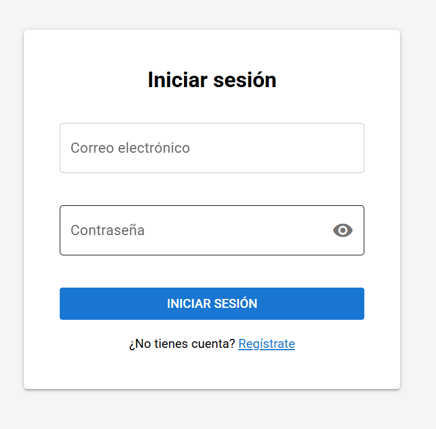
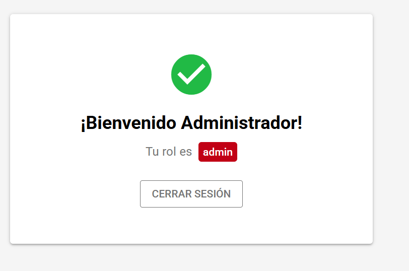
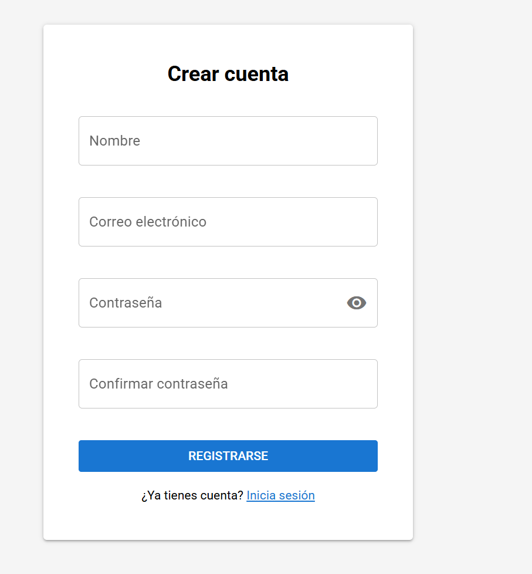
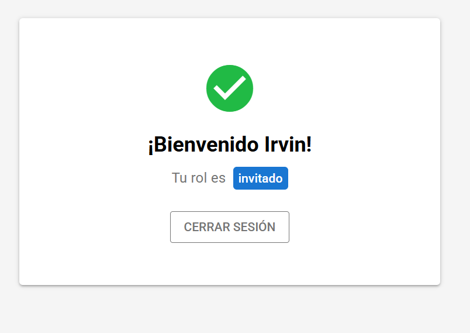

# TNE App

Repositorio orquestador del sistema de autenticación TNE.
Levanta los 3 servicios (base de datos, backend y frontend) con docker-compose.

## Repositorios
- [tne-database](https://github.com/1rv1nn/tne-database.git)
- [tne-backend](https://github.com/1rv1nn/tne-backend.git)
- [tne-frontend](https://github.com/1rv1nn/tne-frontend.git)

## Requisitos
- Docker Desktop instalado y corriendo
- Git

## Instalación

1. Clona este repositorio:
   
`git clone https://github.com/1rv1nn/tne-app.git`

 2. Entra a la carpeta
 
   `cd tne-app`

3. Clona los servicios dentro de esta carpeta:
   
`git clone https://github.com/1rv1nn/tne-backend.git`

`git clone https://github.com/1rv1nn/tne-frontend.git`

4. Copia las variables de entorno:
   
`copy .env.example .env`

5. Levanta todos los servicios:
   
`docker compose up -d`

## URLs
| Servicio | URL |
|----------|-----|
| Frontend | http://localhost:9000 |
| Backend  | http://localhost:3000 |

## Usuario de prueba
| Campo    | Valor          |
|----------|----------------|
| Email    | admin@tne.com  |
| Password | password       |
| Rol      | admin          |

## Detener los servicios

`docker compose down`

## Capturas de Pantalla

**Login**

**Admin**

**Registro**

**Invitado**
